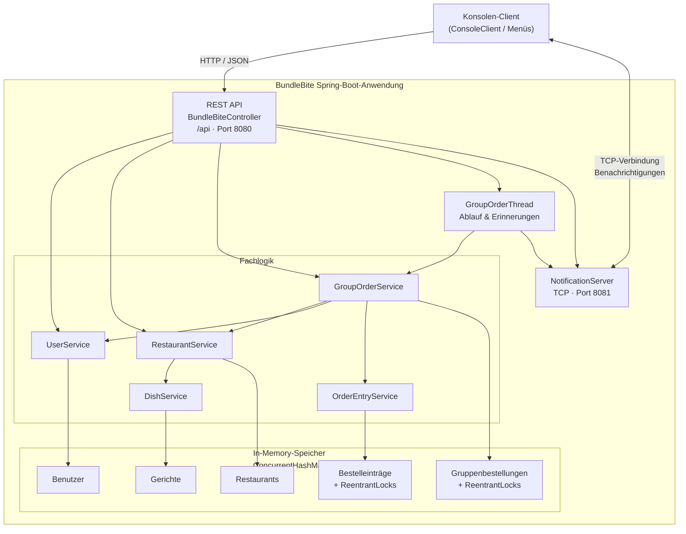

```mermaid
flowchart TB
    Console["Konsolen-Client\n(ConsoleClient / Menüs)"]

    subgraph App["BundleBite Spring-Boot-Anwendung"]
        REST["REST API\nBundleBiteController\n/api · Port 8080"]
        Notify["NotificationServer\nTCP · Port 8081"]
        Timer["GroupOrderThread\nAblauf & Erinnerungen"]

        subgraph Domain["Fachlogik"]
            Users["UserService"]
            Restaurants["RestaurantService"]
            Dishes["DishService"]
            Orders["GroupOrderService"]
            Entries["OrderEntryService"]
        end

        subgraph Memory["In-Memory-Speicher\nConcurrentHashMap"]
            UserStore["Benutzer"]
            RestaurantStore["Restaurants"]
            DishStore["Gerichte"]
            GroupOrderStore["Gruppenbestellungen\n+ ReentrantLocks"]
            EntryStore["Bestelleinträge\n+ ReentrantLocks"]
        end
    end

    Console -->|"HTTP / JSON"| REST
    Console <-->|"TCP-Verbindung\nBenachrichtigungen"| Notify

    REST --> Users
    REST --> Restaurants
    REST --> Orders
    REST --> Timer

    Restaurants --> Dishes
    Orders --> Restaurants
    Orders --> Users
    Orders --> Entries

    Users --> UserStore
    Restaurants --> RestaurantStore
    Dishes --> DishStore
    Orders --> GroupOrderStore
    Entries --> EntryStore

    Timer --> Orders
    Timer --> Notify
    REST --> Notify
```
