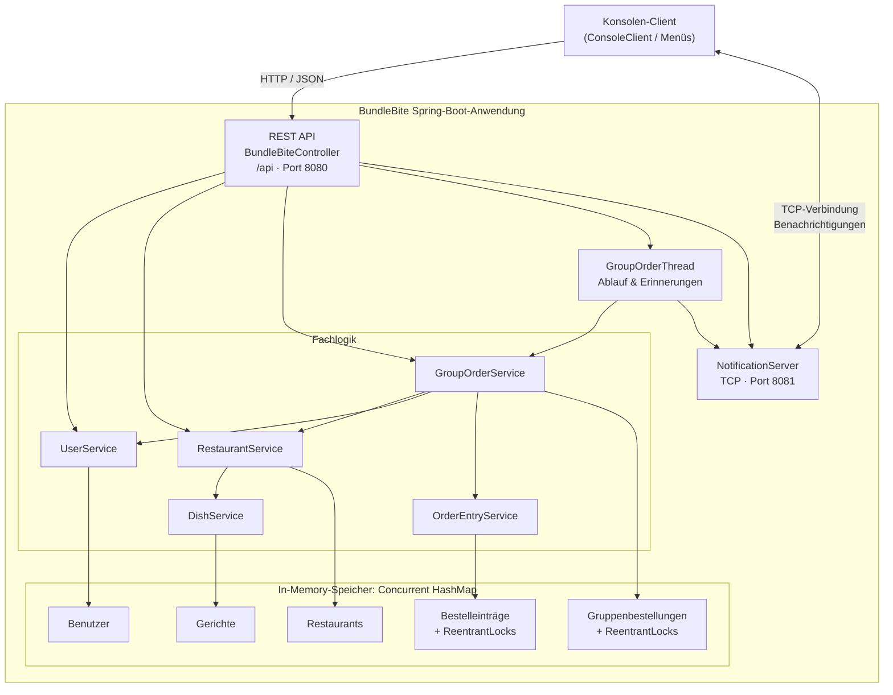

## Über die Applikation

BundleBite ist eine kleine Spring‑Boot‑Anwendung (Java 17 / Spring Boot 4), die Gruppenbestellungen für Essen verwaltet. Sie stellt eine REST‑Schnittstelle bereit, über die ein Konsolen‑Client Bestellungen anlegen, Einträge hinzufügen und den Bestellablauf steuern kann. Zusätzlich gibt es einen Notification‑Server (TCP) für Echtzeit‑Benachrichtigungen und einen Timer‑Thread, der Bestellfristen und Erinnerungen verwaltet.

### Architektur (Kurz)
- REST API: BundleBiteController unter `/api` (Standardport: 8080) — Hauptschnittstelle für Client‑Anfragen.  
- NotificationServer: TCP‑Server (Standardport: 8081) — sendet Benachrichtigungen an Clients.  
- Hintergrundthread: GroupOrderThread steuert Ablauf und Erinnerungen für Gruppenbestellungen.  
- Domäne: Services (UserService, RestaurantService, DishService, GroupOrderService, OrderEntryService) kapseln Geschäftslogik.  
- Speicher: In‑Memory Stores (ConcurrentHashMap) für Benutzer, Restaurants, Gerichte und Gruppenbestellungen; ReentrantLocks sorgen für sichere Parallelität bei Einträgen und Bestellungen.

### Stack
- Sprache: Java 17  
- Framework: Spring Boot 4 (spring-boot-starter-webmvc)  
- Laufzeit: Maven (inkl. Maven Wrapper `mvnw` / `mvnw.cmd`)  

### Wie die Komponenten zusammenwirken
Anfragen vom Konsolen‑Client laufen über die REST API in die Service‑Schicht, die die Domänenmodelle (User, Restaurant, Dish, GroupOrder, OrderEntry) manipuliert. Änderungen werden in den In‑Memory‑Stores gehalten; der GroupOrderThread prüft Fristen und löst bei Bedarf Benachrichtigungen über den NotificationServer aus.

### Architektur 

